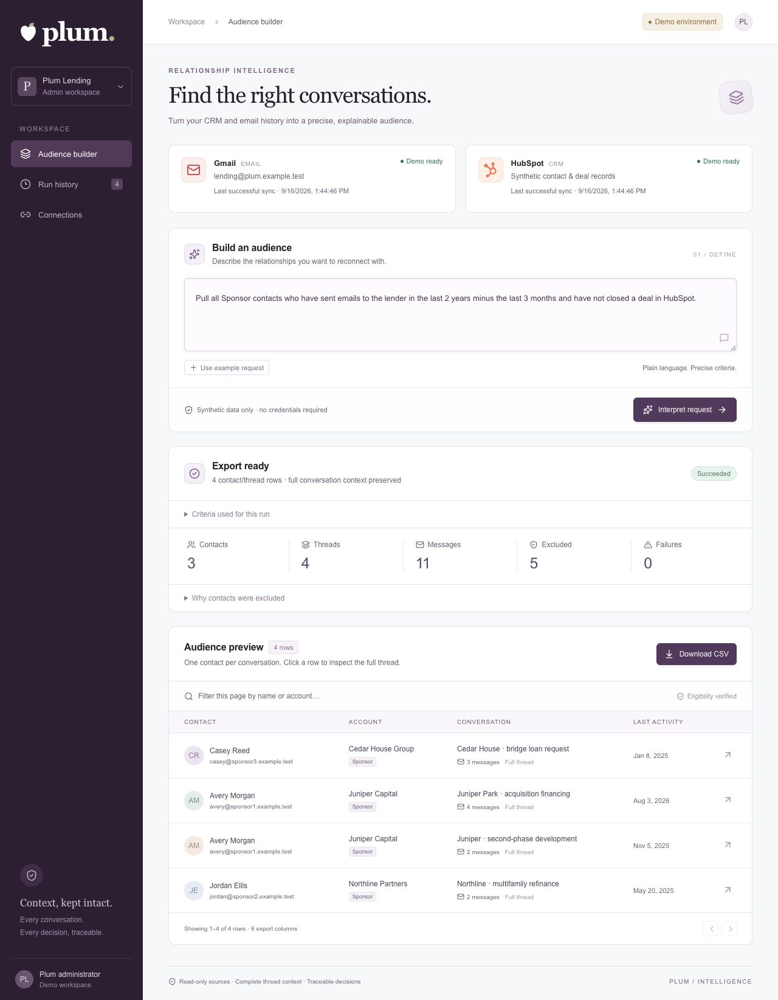
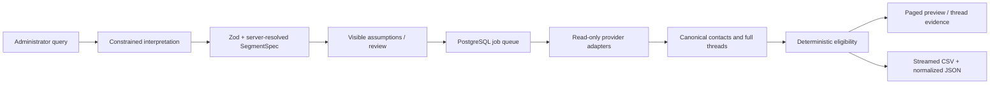

# Plum · Relationship intelligence

A working interview POC for turning CRM relationships and complete email conversations into an explainable contact audience and downloadable CSV.

**Submission status: the complete Gmail + HubSpot + OpenAI vertical slice has passed technical live acceptance using approved fictional data in real accounts.** The browser workflow produced the exact expected 2 contacts, 2 threads and 5 messages in 7.087 seconds, with a verified eight-column CSV download. Five live interpretation cases passed. See [the measured acceptance record](docs/live-acceptance.md) and [baseline report](docs/baseline-report.md). Owner review/rehearsal and publication approval remain separate handoff steps.



## Run the credential-free demo

Requirements: Node.js 22 LTS or newer, pnpm 11.19+ (lockfile included).

```sh
pnpm install --frozen-lockfile
APP_MODE=demo pnpm build
APP_MODE=demo pnpm start
```

Open **http://localhost:3000**. No `.env`, Docker, OpenAI key, Gmail account, or HubSpot account is needed. The embedded worker runs in the same long-lived process; PGlite stores its PostgreSQL data in `.data/demo`. Demo deliberately ignores `DATABASE_URL` to prevent exposing live records. Run only one demo server per data directory.

For editing: `APP_MODE=demo pnpm dev`. Explicit demo mode also keeps the demo available after a live `.env` has been prepared. If your machine has a restrictive file-watcher limit, use the build/start commands above or `WATCHPACK_POLLING=true pnpm dev`.

1. Click **Interpret request** and review the exact criteria.
2. Click **Run segment**.
3. Expect **3 contacts, 4 threads, 11 messages, 5 excluded contacts, 0 failures**, in **4 CSV rows**.
4. Open the Juniper Park thread. It includes both older and newer messages outside the matching window.
5. Download the CSV. Try the partial, empty, and outage scenarios to inspect failure behavior.

The demo clock is fixed at September 16, 2026, 12:00 UTC. Its local parser accepts the example wording with different month/year values; it rejects unsupported wording instead of pretending an LLM was used.

## Connect real accounts — required before final submission

Feature development is paused for the dedicated live-environment baseline (apart from the requested logo and required mailbox privacy safeguards). Begin with [the Phase 0 inspection and exact checklist](docs/phase-0-setup-checklist.md), then follow [the precise live setup guide](docs/live-setup.md). The owner has approved one existing job-search/BenTech Gmail account, conditional on [test-data-only isolation](docs/mailbox-isolation.md). All unrelated correspondence and other personal accounts remain excluded. Account security/consent steps are owner-operated; dataset writes require a reviewed seeder dry-run and explicit approval. The owner authorized up to $1 of model usage and personally handled API funding; no additional purchase, subscription, deployment or publication is authorized. Live mode requires ordinary PostgreSQL, server-side Google OAuth credentials, an OpenAI API key, a HubSpot private-app token, and administrator security settings. OAuth consent and all live processing require the owner's authorization. Do not paste credentials into chat.

```sh
pnpm setup:live
# Edit the newly created .env locally; the command prints no secrets.
# Start Docker Desktop first, then:
docker compose up -d postgres
pnpm config:check
# After owner approval and HubSpot token/property setup:
pnpm hubspot:check
pnpm db:migrate
pnpm build
pnpm start
# In a second terminal:
pnpm worker
```

Current owner-local checkpoint: real reader connections, separate seed grants, controlled seeding/replay, snapshot ingestion/associations, five OpenAI semantic cases and the full natural-language browser → worker → CSV workflow have passed. The seed corpus contains 7 contacts, 7 companies, 3 deals, 6 threads and 9 messages. The live app uses Docker PostgreSQL 17.11 and a separate worker, with receipt-restricted Gmail reads. The final browser run returned exactly 2 contacts, 2 threads and 5 messages in 7.087 seconds with zero failures. All credentials are private and ignored; the owner authorized up to $1 of API testing/rehearsal and confirmed funded API credit with auto-reload off. Live cleanup remains untested. See [acceptance](docs/live-acceptance.md), [baseline](docs/baseline-report.md) and [build journal](docs/build-journal.md).

`setup:live` refuses to overwrite an existing `.env`. Read [live-acceptance.md](docs/live-acceptance.md) before connecting or running. No provider records are modified and no emails are sent by this application.

## Request and data flow



AI is used only for query interpretation in live mode. The model cannot call providers, generate SQL, choose contacts, or see email content. A validated interpretation is stored; the browser starts a job by its ID. All eligibility decisions belong to TypeScript domain logic.

## Meaning of the representative request

- **Sponsor:** exact case-insensitive match to a configured HubSpot contact property/value.
- **Sent emails:** the contact appears in From; the lender mailbox or an explicitly configured owned alias appears in To/CC/BCC.
- **Last two years minus three months:** UTC calendar interval `[asOf − 24 months, asOf − 3 months)`, frozen at interpretation time.
- **No closed deal:** no directly associated deal currently Closed Won, across all pipelines and all time. Closed Lost does not exclude. Unknown or unreadable deal eligibility fails closed.
- A qualifying message causes the **whole accessible thread** to be retained. One row per contact/thread. No guessed or fuzzy identity matches.

The reference sheet was inspected only at its header row. Exact CSV columns: `Email Subject`, `Email Body`, `Account Name`, `First Name`, `Last Name`, `Email`, `Last Activity Date`, `Raw Communication Data`. Subject and body are populated. The raw column contains compact normalized thread JSON; formula protection applies to every cell. Last activity is the newest timestamp in the full thread and can be newer than the matching cutoff.

## Engineering map

| Area | Location | Responsibility |
| --- | --- | --- |
| Typed intent and policy | `src/domain/segment.ts` | Schema, calendar arithmetic, frozen window, assumptions |
| Eligibility | `src/domain/executor.ts` | Contact/deal rules and sender/recipient/date evidence |
| Normalization | `src/domain/normalize.ts` | MIME parts, headers, identities, safe HTML/text, attachments, ordering |
| Adapters | `src/providers/` | Gmail, HubSpot, mocks, contracts, safe read retries |
| Persistence | `src/db/schema.ts`, `db/migrations/` | Drizzle model and checked-in PostgreSQL migration |
| Worker | `src/server/worker.ts`, `repository.ts` | Atomic claims, leases, recovery, fenced publication |
| Security and connections | `src/server/{auth,crypto,oauth,connections}.ts` | Authentication, encrypted tokens, account boundaries |
| Admin API and UI | `src/server/api.ts`, `src/components/` | Review, status, evidence, history, export |
| Verification | `tests/`, `e2e/` | Domain, provider, database, security, and browser checks |

## Commands

```sh
pnpm lint
pnpm typecheck
pnpm test
pnpm build
pnpm exec playwright install chromium
pnpm test:api          # request-level production API tests, no browser launch
pnpm test:e2e          # starts a separate production demo server on port 3100
pnpm sample            # regenerates synthetic CSV and expected counts
python3 scripts/package-source.py
```

Latest local verification: **253 Vitest tests, lint, strict types and production build pass**. The preceding mailbox-isolation checkpoint also passed 4 API tests; those were not rerun for the separate CLI seeder. Earlier [Linux CI](https://github.com/realined/plum-lending/actions/runs/35142338893), before mailbox isolation, passed 174 tests and **11 end-to-end tests (7 browser + 4 API)** plus a native PostgreSQL 17 check with concurrent migrations, separate web/worker processes, authentication and full-thread CSV output. The native worker uses explicitly injected synthetic providers; this is infrastructure proof, not live Gmail/HubSpot acceptance. The Mac sandbox still blocks standalone Chromium, but supported-browser desktop/mobile checks and Linux Chromium both passed. The previous production dependency audit reported no known vulnerabilities.

Run `pnpm build` before browser tests. Tests never call real providers. PGlite integration tests exercise real PostgreSQL SQL semantics; native PostgreSQL connectivity and provider consent remain part of mandatory live validation. The source-only archive accompanies the live acceptance evidence; owner review and publication approval remain separate. A generated source manifest limits archive contents; do not zip the entire directory.

ESLint 9 and TypeScript 5.9 are pinned because the installed Next.js lint stack is incompatible with ESLint 10 and TypeScript 7. This is a development-tool compatibility choice; revisit upgrades together, not independently.

## Important limits

Single administrator, mailbox and CRM. Snapshot retrieval is sequential and held in memory; large mailboxes need candidate-focused indexing and streaming. Gmail incremental history is implemented as an adapter capability but not scheduled as continuous synchronization. No Outlook or Salesforce adapters are claimed complete. No multitenancy, enterprise SSO, distributed rate limiter, or deployment is included. Read [production notes](docs/production.md) for the deliberate extension seams.

## Version control

The project is versioned in the private GitHub repository [realined/plum-lending](https://github.com/realined/plum-lending). Local `main` tracks `origin/main`; the initial implementation is preserved in commit `2be9c79`, and the first push was verified against GitHub's branch SHA. Subsequent changes should be small, reviewable commits after the relevant checks pass.

```sh
git status
git log --oneline -5
git diff
```

Work on a feature branch for each meaningful change, review the diff, and stage only intended source files. `.env`, runtime databases, live exports, logs, dependencies, and build output are ignored. Keep real-data evidence out of source files too: ignore rules cannot protect sensitive content copied into tracked documentation. The source ZIP deliberately excludes `.git`; it is a portable snapshot, not a backup of repository history.

## Interview and operating guides

- [Requirements and UI wiring audit](docs/requirements-audit.md) — current evidence, unfinished interactions, and next acceptance gates
- [Build journal](docs/build-journal.md) — phase decisions, results, and remaining gates
- [Architecture and ADR](docs/architecture.md)
- [Assumptions](docs/assumptions.md)
- [Security and privacy](docs/security.md)
- [Live setup](docs/live-setup.md) and [mandatory acceptance](docs/live-acceptance.md)
- [Demo script](docs/demo-script.md)
- [Interview walkthrough](docs/interview-walkthrough.md)
- [Task checklist](docs/checklist.md)
