# Requirements and UI wiring audit

**Current status:** this document preserves the earlier audit. Its historical “pending” findings are superseded by the verified technical live baseline in `baseline-report.md` and `live-acceptance.md`: real Gmail/HubSpot/OpenAI, browser execution, deterministic results and CSV download now pass.

> Follow-up implementation checkpoint: the shell controls, URL navigation, draft/result separation, setup flags and scenario labels below have now been implemented and manually verified. OAuth/AI boundary coverage, CRM-scoped Gmail retrieval, safe job errors and worker heartbeat are also implemented; 174 offline tests pass. Linux CI has passed all 11 browser/API tests plus native PostgreSQL with a separate fixture worker; [evidence](https://github.com/realined/plum-lending/actions/runs/35142338893). This audit retains the original findings as historical context; `checklist.md` and `build-journal.md` track the current evidence. No real-account acceptance has occurred.

Reviewed 2026-09-16 against application commit `1b790a7`, the owner's original request and later live-acceptance clarification, and the locally preserved challenge page. A fresh request to the challenge page returned HTTP 403 during this review, so its previously downloaded text was used. No live provider connection or processing was performed.

**Assessment: working synthetic export workflow; unfinished interaction design; real-account proof still outstanding. Not ready for submission.** The application has a real API, database, job worker, deterministic executor, normalized results, and CSV stream. The current demo substitutes fixtures for Gmail/HubSpot and a bounded rules parser for OpenAI. The surrounding interface also includes static elements styled like controls. These are different gaps and need different remedies.

## What the challenge actually asks us to prove

The [original challenge](https://summit-slate-w5z5.here.now/) centers on three steps: connect email and CRM accounts, request a segment in natural language, and display/export structured conversations. Full thread context must survive. The expected runtime is minutes ideally and a few hours at most. Its proof-of-concept gate is the owner's email plus a free HubSpot instance using real data. The later owner clarification makes that gate mandatory.

The agreed implementation is Gmail + HubSpot first, with Outlook/Salesforce extension interfaces and documentation. We do not need to build four production integrations, multiple workspaces, team administration, or a general CRM product to finish this challenge.

## Requirement-to-evidence matrix

| Requirement | What exists | Verification and remaining gap |
| --- | --- | --- |
| Gmail connection | Server OAuth authorization code flow, PKCE/state, scope checks, encrypted refresh token, refresh handling | Code and supporting token/provider tests exist. No successful real OAuth consent. The complete start/callback HTTP flow lacks direct automated tests. |
| HubSpot connection | Masked token form, server validation of contacts/property/companies/deals/pipelines, encrypted persistence | Mocked provider tests pass. No real private-app token validation or live ingestion. Sponsor property/value must be confirmed against the real account. |
| Natural-language request | Reviewable Zod-validated intent/spec; OpenAI Responses parser in live mode | Demo accepts the example sentence and bounded duration variations through a regex. Real OpenAI parsing has not run, and the server OpenAI response boundary lacks direct mocked coverage. Schema tests alone do not prove language interpretation. |
| Visible interpretation | Sponsor mapping, inbound direction, frozen UTC window, direct Closed Won rule and full-thread policy | Wired to the saved interpretation. Editing a query can leave an earlier run's results below it; the UI needs clearer separation of the draft and selected run. |
| Deterministic CRM/email filtering | Exact normalized email joins, primary/secondary identities, role/window/direction/deal checks, unknown eligibility excluded | Well covered by synthetic domain/provider tests. Not yet compared with independently known real-account cases. Current Won is the policy, not historical ever-Won; company-only deals do not exclude every contact. |
| Full-thread normalization | Gmail full-thread fetch; recursive MIME/text handling; headers, recipients, dates, direction, attachment metadata and order | Mocked MIME tests and synthetic UI/CSV checks pass. Actual Gmail payload diversity and full-context preservation remain live gates. Binary attachments and unavailable/deleted mail are outside the exported content. |
| Background processing | Persisted jobs, atomic SQL claims, leases/heartbeats, fencing, retries for abandoned jobs, transactional publication | Demo worker actually executes outside the request. PGlite SQL tests pass. Separate web/worker processes on native PostgreSQL remain unverified. No cancellation or durable per-thread resume checkpoints. |
| Admin CSV preview/download | Results API, 25-row preview pages, full-thread drawer, normalized JSON, streamed eight-column CSV | Working with synthetic data. Fresh API tests again verified the pipeline and CSV response. No CSV from live-connected data has been produced. |
| Provider status and synchronization time | Stored connection status and last successful export-ingestion timestamp | Demo timestamps derive from demo jobs. Stored live connection status is not a fresh provider health check; there is no worker readiness indicator or separate sync action. |
| Incremental synchronization | Gmail history adapter and cursor columns | Not connected to the execution path. OAuth does not persist the returned initial cursor; worker never calls `synchronize`. Current runs take fresh snapshots. Continuous synchronization remains documented extension work, not a completed capability or a necessary standalone POC gate. |
| Pagination, rate limits, idempotency and partial failure | Provider pagination, safe GET retries, stable IDs/upserts, partial thread/association failures | Automated synthetic tests cover these. Broad candidate retrieval and serial API calls have no realistic-volume benchmark. Whole-job errors discard useful safe error categories. |
| Security | Server credentials, encryption boundary, authentication, mutation-origin checks, HTML sanitization, formula-safe CSV, local deletion/disconnect logic | Supporting tests exist; no secrets or real correspondence used for this audit. Live session/OAuth/disconnect behavior is not yet verified as one connected system. |
| Polished admin interaction | Three functional navigation tabs and the main export workflow | Static selector/profile/breadcrumb elements imply behavior that is absent. View selection uses React state without URL navigation, so refresh/back/deep-link behavior is incomplete. |
| Documentation/version control | Setup, architecture, assumptions, security, walkthrough, tests, sample CSV, private GitHub history | Present. Completion claims must continue distinguishing code, mocked verification, and live acceptance. |

## The specific controls the owner identified

| Visible element | Current behavior and evidence | Recommended treatment within scope |
| --- | --- | --- |
| Audience builder, Run history, Connections | All three buttons have handlers and navigated successfully during this audit | Keep them; make navigation URL-backed, preserve selected runs where appropriate, and test refresh/back behavior. |
| Workspace card with down-chevron, upper left | Static `div`; no handler, menu, or workspace switching (`workspace-shell.tsx:30`) | Remove the switcher affordance for this single-workspace POC. Only add a menu if it exposes real, useful actions. Do not invent multitenancy. |
| Workspace breadcrumb | Static text and chevron (`workspace-shell.tsx:100`) | Make the root a real navigation link; keep the current location as a clearly noninteractive label. |
| Upper-right avatar / perceived dropdown | Static `span`, no dropdown (`workspace-shell.tsx:118`) | Use one accessible account menu for real actions such as workspace information and live sign-out, or make it clearly noninteractive. No placeholder preferences pages. |
| Bottom-left administrator/profile | Static identity block; only a separate live-mode sign-out button is wired (`workspace-shell.tsx:75`) | Avoid duplicate pretend menus. Consolidate with the account control or clearly present it as an identity label. |
| Gmail/HubSpot connection cards in demo | Connect buttons are deliberately hidden unless `mode === 'live'` (`connection-cards.tsx`) | Provide a clear setup entry point and readiness checklist. Keep demo/live data isolation; do not silently switch mode or start OAuth. |
| Run history | Real saved jobs, latest 12 only; demo scenarios not shown in row labels | Distinguish standard/partial/empty/outage runs so identical queries with different outcomes are understandable. Full history pagination can remain a documented limit. |
| Result filtering/paging | Filtering affects the current page only; pagination is disabled for the four-row demo | Already labeled, but should be included in the interaction checklist. It is not a whole-export search. |

The user is right to call out these visual placeholders. Earlier UI verification exercised the export journey and responsive layout; it did not establish a complete interaction inventory for the application shell. That was a gap in the verification scope.

## What is really connected in demo mode

```mermaid
flowchart LR
  A[Query in browser] --> B[POST interpret]
  B --> C[Demo rules or live OpenAI parser]
  C --> D[Validated spec stored in database]
  D --> E[Review and POST jobs]
  E --> F[Durable job and worker]
  F --> G[Synthetic providers or live Gmail + HubSpot]
  G --> H[Canonical threads + deterministic filtering]
  H --> I[Stored results]
  I --> J[Polling UI / thread drawer / CSV stream]
```

Important modules: `src/components/workspace*.tsx` orchestrate the UI; `src/server/api.ts` stores interpretations and enqueues jobs; `parser.ts` chooses demo/live interpretation; `worker.ts` chooses providers; `src/domain/executor.ts` decides eligibility; `normalize.ts` and `csv.ts` handle content and output; `repository.ts` persists canonical data and results. The displayed rows are not hardcoded into the table.

## Risks to resolve before declaring the live slice ready

1. **Retrieval breadth and runtime.** Gmail searches only by date, then fetches every candidate full thread before matching eligible contacts (`gmail.ts:48`, `executor.ts`). Even an empty eligible CRM audience still triggers the mailbox scan. HubSpot loads all objects and makes association reads per contact. This may read unrelated personal mail into process memory and be slow on a real mailbox. Qualifying results are persisted, but transient retrieval is broader. Narrow candidates using eligible CRM identities, preserve deterministic final checks and full matched-thread context, and measure realistic counts/duration. Do not call the runtime target satisfied from a four-thread fixture.
2. **Unproven integration boundaries.** Add mocked OAuth start/callback tests for valid/invalid state, denied consent, missing scopes and refresh tokens, plus mocked OpenAI response/refusal/timeout/invalid-output tests. Then run real OAuth, actual HubSpot mapping, and a small set of semantic language checks after authorized setup. A schema-valid response can still misinterpret a sentence.
3. **Unhelpful failure recovery.** Whole-job failures collapse into one generic error and log event. Retain sanitized provider/stage/error codes and useful retry/reconnect guidance, without response bodies, identities or tokens. Distinguish a stopped worker from a healthy queue. Re-running currently requires interpreting again.
4. **Draft versus result ambiguity.** `changeQuery` clears the interpretation but leaves the prior job/results. Preserve access to historical results while labeling their ownership so an edited query cannot appear to have already produced them.
5. **Completion evidence.** Native PostgreSQL plus separate worker, real data correctness, actual runtime, and the standalone browser suite are still pending. Continuous sync, production scaling, SSO and extra adapters should remain clearly deferred rather than becoming distractions.

## Validation performed for this audit

- Reviewed original request, subsequent live requirement, saved challenge text, source modules, execution plan and test coverage.
- Inspected the currently running demo in the supported browser. Confirmed all three sidebar destinations; opened and closed the Juniper thread drawer, observing all four chronological messages, including context before/after the eligible window. Restored the original Run history view. No destructive action or provider connection was attempted.
- Ran `pnpm test:api` against a separate production demo server and isolated synthetic database: **3 passed in 6.1 seconds**. This verified interpretation → persisted job → worker → exact counts → CSV, idempotent submission, partial/empty/outage states, and request boundaries.
- Latest unchanged-application evidence from the relocation phase remains **136 passing Vitest tests, lint, strict types and production build passing**. These were not rerun solely for this documentation audit.
- Four standalone Playwright browser tests remain unverified because their prior Chromium launch was blocked by the macOS sandbox. The request-level tests do not launch Chromium, despite the shared project label. No new browser-runner pass is claimed.
- No live Gmail, HubSpot or OpenAI calls; no native PostgreSQL acceptance; no live export; no full-dataset runtime measurement.

## Recommended next phases and completion gates

**A. Finish interaction design and offline integration proof.** Address the exact shell controls above, make setup and demo limitations visible, distinguish draft/run/scenario states, improve safe error/readiness feedback, and close OAuth/OpenAI boundary test gaps. Review candidate retrieval breadth before personal-mail ingestion. Complete when the control inventory has verified click/keyboard/navigation outcomes, the added tests pass, and existing deterministic/CSV behavior remains intact. Keep the present technology and single-workspace scope.

**B. Guided account setup and live vertical slice.** Give the owner the existing precise `.env`/Google/HubSpot/PostgreSQL/OpenAI setup instructions, confirm real Sponsor mapping and historical test cases, and obtain explicit permission before connecting/processing. Start native PostgreSQL and separate worker; prove Gmail consent, HubSpot reads, interpretation, filtering, full threads and CSV using the owner's accounts. Complete only with independently checked inclusion/exclusion cases, an error-free live export, and count-only evidence. The recent-three-month exclusion requires historical correspondence, not only newly sent test emails.

**C. Submission and interview rehearsal.** Verify runtime on the chosen live dataset, run standalone browser automation on a supported normal host or CI, review the final diff, refresh the walkthrough around what actually worked, and rehearse the demo. Keep live exports and identifying evidence private. Defer Outlook/Salesforce, continuous synchronization and multitenancy as already agreed.

**Owner decisions/actions.** No credentials or new architecture decision are needed for this audit. The next engineering work should fix the misleading interactions. Account configuration and live-processing authorization come at phase B; neither is implied by GitHub sign-in or this review.

**Interview concepts.** Demonstrated behavior versus implemented code; constrained interpretation versus deterministic eligibility; matching-message selection versus complete-thread preservation; durable jobs versus incremental synchronization; safe, bounded retrieval versus broad scans; completion gates grounded in real-account evidence.
