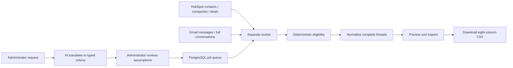

# Original challenge verification and demonstration guide

Reviewed against the saved original Plum challenge page and the owner's expanded implementation requirements. A fresh request to the hosted brief failed, so this review uses the previously saved original HTML, not an invented reconstruction. The original explicitly starts with the candidate's email and a free HubSpot instance; Gmail + Salesforce is the next stage after proving the core.

## What problem the application solves

A lender wants to reconnect with Sponsors who previously contacted them but have not closed a deal. CRM data alone cannot establish the email history; mailbox search alone cannot establish Sponsor classification or deal outcome. Manually joining both systems and copying conversations into a spreadsheet is slow and inconsistent.

The app turns a plain-language request into reviewed rules, applies them to actual CRM/email data, and produces an explainable, normalized export. It prepares communication data for downstream human or LLM analysis. It does not send outreach, approve loans, or ask AI to decide contact eligibility.



Only the administrator's request is sent to OpenAI. Provider records and email bodies stay in the application pipeline.

## Original requirements mapped to evidence

| Original requirement | Implemented behavior | Evidence / qualification |
| --- | --- | --- |
| Email account connection | Direct Gmail OAuth, server-side token exchange and encrypted credentials | Actual owner consent, profile match, read-only connection and live ingestion pass |
| CRM connection | HubSpot private-app token; contacts, companies, deals and associations | Real free account validated and ingested; the brief allows the simpler API credential path |
| Natural-language segmentation | OpenAI Responses structured output → validated intent → frozen SegmentSpec | Five live semantic cases plus the browser's representative request pass |
| Admin interface | Connections, visible interpretation, Run, background status, counts, history, results | Supported-browser live journey verified; GitHub Chromium suite passes |
| Complete conversation normalization | Sender, recipients, timestamps, direction, body, attachment metadata and ordered full thread | Four-message Cedar thread retains recent context outside the matching window; JSON and CSV verified |
| Immediately accessible structured output | Result table and streamed downloadable CSV | Eight compatible headers, two live rows, populated subject/body and parsable full JSON |
| One thread per row allowed | One contact/thread pair per row | Matches the original brief's permitted format variation |
| Runtime in minutes, hours maximum | Separate worker completes asynchronously | 7.087 seconds for the small live corpus; not a large-mailbox performance claim |
| Real-data POC with own email + free HubSpot | Approved fictional records stored in actual services | Real Gmail/HubSpot API reads, not mock providers, drive the live demonstration |
| Expansion to actual Plum stack | Provider interfaces and production notes | Salesforce/Outlook not implemented; this is documented next-stage work |

The owner's additional engineering requirements are represented by strict TypeScript/Zod, canonical PostgreSQL schema, durable leases/idempotent upserts, provider pagination/retries, partial-error handling, HTML/CSV safety, credential isolation, demo mode and automated tests. Continuous incremental synchronization is a documented extension: current exports perform fresh snapshots.

## Where the seeded Gmail messages are

The Gmail connector independently confirmed the approved mailbox contains **9 messages in 6 threads** under **`bentech-lending-poc-v1`**, with **0 messages in Inbox**. Search this in the approved lab account:

```
in:anywhere label:bentech-lending-poc-v1
```

The separate seed writer uses Gmail message insertion with controlled historical dates and the custom label. It does not send mail, and it does not assign the Inbox label. These are real Gmail-stored messages with fictional content. Their older dates and lack of Inbox labeling explain why they are not visible at the top of Inbox. No relabeling is needed for application ingestion. Do not broadly browse unrelated mail while demonstrating the source.

Seeding creates the controlled evidence in the service accounts. Ingestion is the normal app reading that evidence through read-only connections. Demo mode is a third, separate path using offline fixture providers; its counts differ and must be labeled honestly.

## What to show, function by function

1. **Source evidence:** in the approved Gmail account, show only the seed label; in HubSpot show the reviewed fictional contacts/deals. Explain historical timestamps were intentionally inserted for testing, not organically received over two years.
2. **Connection layer:** show Live data and connected Gmail/HubSpot. Authentication is real; the app has no seed-writing permission.
3. **Intent:** use the challenge sentence. Show Sponsor, inbound email, a frozen UTC interval covering 24 months minus the recent 3 months, and no currently Closed Won directly associated deal.
4. **Execution:** run the saved criteria. The worker reads provider snapshots and deterministic code decides eligibility; the browser can leave and return.
5. **Correctness:** show 2 contacts, 2 threads, 5 messages, 5 exclusions and no failures. Closed Lost remains eligible; Closed Won does not. Recent-only, too-old, non-Sponsor and no-mail cases are excluded.
6. **Context:** open Cedar's four-message conversation. Two messages qualify, but all four survive, including the recent lender reply, CC and attachment metadata.
7. **Output:** download the CSV. It contains both readable conversation text and machine-readable normalized JSON, one contact/thread pair per row.
8. **Traceability:** return through Run history; explain stable provider IDs, repeat ingestion, and why opaque attachment retrieval handles may change without changing eligibility/content.

## Audit findings and proposed improvements

The review found one real parsing edge case: named recipient groups were being omitted, which could misclassify inbound email. Fixed by recursively flattening address groups before identity/direction matching. Four focused regressions failed before the fix and pass afterward; the complete 257-test suite, lint, strict types and production build pass.

Remaining recommendations are intentionally separate from baseline feature scope:

- **High-value correctness/clarity:** distinguish unresolved email eligibility from a proven no-match when some threads fail to load; preserve the visible partial-result warning.
- **High-value UI polish:** use a neutral initial environment label while loading; avoid telling the owner to start an already-running worker; give specific safe explanations for unsupported query conditions.
- **Presentation polish:** rehearse the source → criteria → result story, then create the overview video/script and ElevenLabs narration only after final owner readiness approval. The owner reports ElevenLabs is signed in; no audio generation or credit use is authorized yet.
- **Production hardening:** batch CRM association reads, bound provider concurrency, add safe model usage/latency metrics and wider semantic evaluations, improve expiry/recovery operations, and benchmark realistic data volume.
- **Out of current scope:** additional providers, multitenancy, vector search, generalized agents, continuous sync and deployment.

“Ready” means the agreed baseline is implemented and supported by the tests and live evidence, with limitations disclosed. It does not mean every provider failure or production load has been tested. Live cleanup/destructive deletion remain intentionally unexercised against the presentation corpus.
